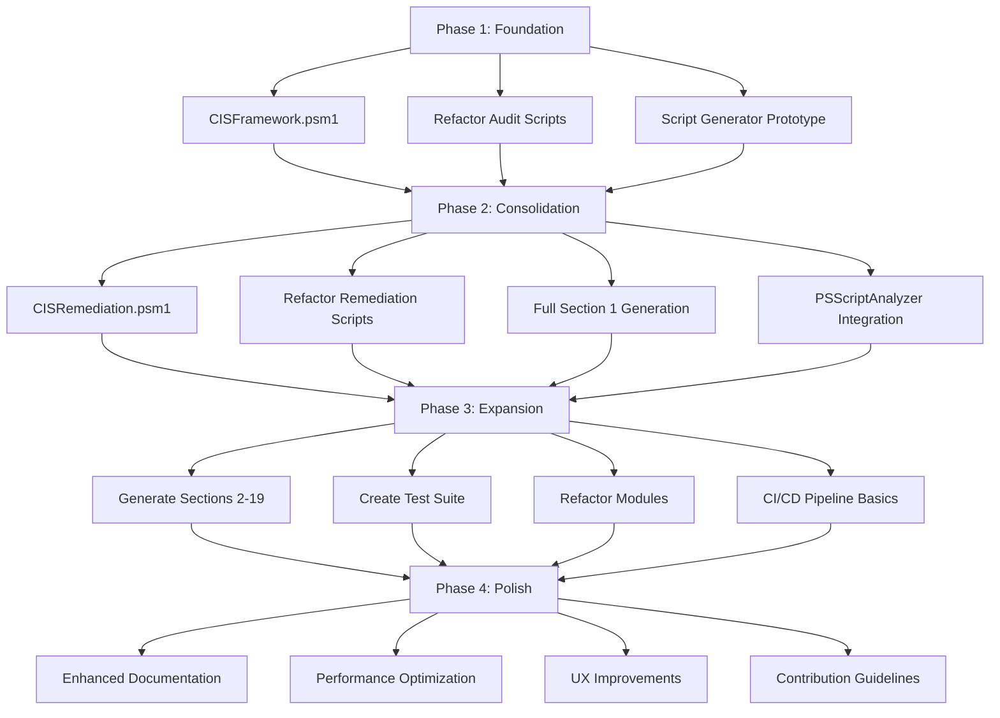

# Project Improvement Attack Plan

## Overview
This attack plan tracks the implementation of improvements identified in [`project_analysis_and_improvement_opportunities.md`](docs/project_analysis_and_improvement_opportunities.md). The plan organizes work into phases, prioritizes tasks, and provides tracking mechanisms for progress.

**Last Updated**: 2026-01-15
**Status**: Phase 3 In Progress - Test Suite Foundation Established

## Executive Summary
The Windows Automation Scripts project requires systematic improvements to address code duplication, enhance modularity, and improve scalability. This attack plan outlines a phased approach to implement the recommended changes while maintaining backward compatibility.

## Phased Implementation Strategy

### Phase 1: Foundation (High Priority)
**Goal**: Establish core frameworks and reduce audit script duplication

#### 1.1 CIS Audit Framework Module
- **Task**: Create `windows/modules/CISFramework.psm1`
- **Components**:
  - `Invoke-CISAudit` - Generic audit function
  - `New-CISResultObject` - Standardized result object
  - `Get-CISRecommendation` - JSON data retrieval
  - `Test-CISCompliance` - Generic compliance testing
- **Success Criteria**: Audit script size reduction ≥80%
- **Dependencies**: None
- **Status**: ✅ Completed (2026-01-14)

#### 1.2 Refactor Existing Audit Scripts
- **Task**: Update existing 11 audit scripts to use CISFramework
- **Approach**: Maintain backward compatibility while reducing duplication
- **Files**: `windows/security/audits/*.ps1`
- **Status**: ✅ Completed (2026-01-14)
- **Results**: 51-52.5% average code reduction across all Section 1 scripts

#### 1.3 Script Generation Prototype
- **Task**: Create `helpers/generate_cis_scripts.py` prototype
- **Functionality**: Generate scripts for password policy controls (Section 1.1.1-1.1.7)
- **Status**: ✅ Completed (2026-01-14)
- **Results**: Generated 6 remediation scripts (1.1.2-1.1.7) with standardized structure

### Phase 2: Consolidation (High Priority)
**Goal**: Extend frameworks to remediation scripts and expand automation

#### 2.1 CIS Remediation Framework Module
- **Task**: Create `windows/modules/CISRemediation.psm1`
- **Components**:
  - `Invoke-CISRemediation` - Generic remediation with confirmation
  - `Apply-SecurityPolicyTemplate` - Standardized secedit template application
  - `Get-DomainRemediationInstructions` - Domain-specific guidance
- **Status**: ✅ Completed (2026-01-14)
- **Results**: Created with 6 functions including result objects, template application, and summary reporting

#### 2.2 Refactor Remediation Scripts
- **Task**: Update existing 4 remediation scripts to use CISRemediation
- **Files**: `windows/security/remediations/*.ps1`
- **Status**: ✅ Completed (2026-01-14)
- **Progress**: 4 of 4 scripts refactored (1.1.1-1.1.4)
- **Results**: 73.7% average code reduction across all refactored scripts

#### 2.3 Full Script Generation for Section 1
- **Task**: Extend script generator to handle all Section 1 controls
- **Scope**: Password policies (1.1.1-1.1.7) and account lockout policies (1.2.1-1.2.4)
- **Status**: ✅ Completed (2026-01-14)
- **Results**: Generated 8 remediation scripts for account lockout controls (1.2.1-1.2.4) with standardized structure

#### 2.4 PSScriptAnalyzer Integration
- **Task**: Create `.psscriptanalyzer.psd1` configuration
- **Functionality**: Enforce coding standards, detect common issues
- **Status**: ✅ Completed (2026-01-14)
- **Results**: Comprehensive configuration with custom rules for CIS framework usage

### Phase 3: Expansion (Medium Priority)
**Goal**: Scale to all CIS sections and improve testing

#### 3.1 Generate Scripts for Remaining CIS Sections (CIS ID Batched Approach)
- **Task**: Generate scripts for sections 2-19 in manageable batches of 10 CIS IDs at a time
- **Scope**: All remaining CIS benchmark controls
- **Estimated Scripts**: 100+ audit/remediation pairs
- **Status**: Not Started

**Batching Strategy**: Work will be completed in batches of 10 CIS IDs at a time using incremental JSON file reading to prevent memory overload. This approach specifically addresses the issue of large JSON files that cannot be processed entirely.

**Updated JSON File Structure**: The CIS JSON data has been split into smaller, more manageable files:
- **Section 1**: Split into `cis_section_1_1.json` (password policies) and `cis_section_1_2.json` (account lockout policies)
- **Section 2**: Split into 10 files (`cis_section_2_1.json` through `cis_section_2_10.json`) for User Rights Assignment and Security Options
- **Section 5**: Split into 5 files (`cis_section_5_1.json` through `cis_section_5_5.json`) for Services
- **Section 9**: Split into 2 files (`cis_section_9_1.json` and `cis_section_9_2.json`) for Windows Firewall
- **Section 17**: Split into 3 files (`cis_section_17_1.json` through `cis_section_17_3.json`) for User Account Control
- **Section 18**: Split into 32 files (`cis_section_18_1.json` through `cis_section_18_32.json`) for Application Control
- **Section 19**: Split into 2 files (`cis_section_19_1.json` and `cis_section_19_2.json`) for Advanced Security Options

**Incremental JSON Processing Methodology**:
- Each batch processes exactly 10 CIS IDs (5 audit + 5 remediation pairs)
- **Read JSON files in chunks**: Process only 10 CIS IDs at a time from the appropriate JSON file
- **Use file-based batching**: Each JSON file contains a manageable subset of CIS IDs for easier processing
- **Clear memory between batches**: Explicitly clear variables and memory after each batch
- **Track file position**: Resume reading from the last processed CIS ID within each file

**Concrete Batch Structure with Specific CIS IDs**:

**Section 2 Batches** (Local Policies - Large section requiring chunked processing):
```
Batch 1: CIS IDs 2.2.1-2.2.10 (User Rights Assignment - Part 1)
Batch 2: CIS IDs 2.2.11-2.2.20 (User Rights Assignment - Part 2)
Batch 3: CIS IDs 2.2.21-2.2.30 (User Rights Assignment - Part 3)
Batch 4: CIS IDs 2.2.31-2.3.1.1 (User Rights Assignment - Part 4 + Security Options start)
Batch 5: CIS IDs 2.3.1.2-2.3.2.1 (Security Options - Accounts + Audit)
Batch 6: CIS IDs 2.3.2.2-2.3.4.1 (Security Options - Audit + Devices)
Batch 7: CIS IDs 2.3.7.1-2.3.7.4 (Security Options - Interactive logon)
Batch 8: CIS IDs 2.3.7.7-2.3.8.2 (Security Options - Interactive logon + Microsoft network client)
Batch 9: CIS IDs 2.3.8.3-2.3.9.2 (Security Options - Microsoft network client + server)
Batch 10: CIS IDs 2.3.9.3-2.3.10.2 (Security Options - Microsoft network server + Network access)
Batch 11: CIS IDs 2.3.10.3-2.3.10.12 (Security Options - Network access completion)
```

**Specific JSON Reading Instructions**:

```python
# Example incremental JSON reading approach for split JSON files
import json
import os

def process_cis_ids_in_chunks(section_number, subsection_number, start_cis_id, batch_size=10):
    """Process CIS IDs in small chunks from split JSON files to avoid memory issues"""
    processed_ids = []
    
    # Construct JSON file path based on section and subsection
    json_file_path = f"docs/json/cis_section_{section_number}_{subsection_number}.json"
    
    if not os.path.exists(json_file_path):
        # Try alternative subsection if file doesn't exist
        json_file_path = f"docs/json/cis_section_{section_number}_1.json"
        if not os.path.exists(json_file_path):
            raise FileNotFoundError(f"JSON file not found: {json_file_path}")
    
    # Read file incrementally
    with open(json_file_path, 'r') as file:
        data = json.load(file)
        
        # Find starting position
        start_index = 0
        for i, item in enumerate(data):
            if item.get('cis_id') == start_cis_id:
                start_index = i
                break
        
        # Process only batch_size items
        for i in range(start_index, min(start_index + batch_size, len(data))):
            cis_item = data[i]
            processed_ids.append(cis_item['cis_id'])
            
            # Generate audit script
            generate_audit_script(cis_item)
            
            # Generate remediation script
            generate_remediation_script(cis_item)
    
    return processed_ids

def get_json_files_for_section(section_number):
    """Get all JSON files for a given section"""
    json_files = []
    base_path = "docs/json"
    
    # List all files in the directory
    for filename in os.listdir(base_path):
        if filename.startswith(f"cis_section_{section_number}_") and filename.endswith(".json"):
            json_files.append(os.path.join(base_path, filename))
    
    # Sort files numerically by subsection
    json_files.sort(key=lambda x: int(x.split('_')[-1].split('.')[0]) if x.split('_')[-1].split('.')[0].isdigit() else 0)
    
    return json_files
```

**Batch Completion Criteria**:
- 10 audit scripts generated and tested
- 10 remediation scripts generated and tested
- Scripts integrated with existing frameworks
- Documentation updated for completed CIS IDs
- Pester tests created for batch scripts

**Progress Tracking**: Each batch will be tracked individually with completion metrics for:
- Number of CIS IDs processed (always 10 per batch)
- Script generation success rate
- Framework integration status
- Testing completion percentage

**Quality Assurance**: Each batch undergoes:
- PSScriptAnalyzer validation
- Pester test suite execution
- Manual verification of sample scripts
- Documentation review and updates

**Risk Mitigation**: If any batch encounters issues:
- Batch size can be reduced to 5 CIS IDs
- Additional testing cycles can be added
- Framework adjustments can be made between batches
- Rollback procedures are available for problematic CIS IDs

**Memory Management**: Large sections will be processed in chunks to avoid overwhelming system resources:
- Read JSON files in smaller chunks when necessary
- Process controls incrementally
- Clear memory between batches
- Monitor system resources during processing

#### 3.2 Create Test Suite with Pester
- **Task**: Establish `tests/` directory structure
- **Components**:
  - `tests/unit/` - Module function tests
  - `tests/integration/` - Script behavior tests
  - `tests/PesterConfig.psd1` - Test configuration
- **Status**: ✅ Completed (2026-01-15)
- **Results**: Comprehensive test suite created with 5 test files covering unit and integration tests, test helpers, configuration, and runner script

#### 3.3 Refactor Module Structure
- **Task**: Reorganize modules for better separation of concerns
- **New Structure**:
  ```
  windows/modules/
  ├── AdminUtils.psm1           # Admin rights, elevation
  ├── SystemInfo.psm1           # System information, services
  ├── PowerSchemes.psm1         # Power scheme management
  ├── PowerSettings.psm1        # Power setting operations
  ├── Windows11PowerMode.psm1   # Windows 11 Power Mode specific
  ├── RegistryOps.psm1          # Registry operations
  ├── SecurityPolicy.psm1       # secedit, net accounts, security policy
  ├── UIOutput.psm1             # UI formatting
  └── ModuleIndex.psm1          # Updated module loader
  ```
- **Status**: Not Started

#### 3.4 Implement CI/CD Pipeline Basics
- **Task**: Create `.github/workflows/validate.yml`
- **Functionality**: Automated validation with PSScriptAnalyzer and Pester
- **Status**: Not Started

### Phase 4: Polish (Low Priority)
**Goal**: Enhance documentation and user experience

#### 4.1 Enhanced Documentation
- **Task**: Expand `docs/` directory structure
- **Components**:
  - `docs/api/` - Auto-generated module documentation
  - `docs/tutorials/` - Step-by-step guides
  - `docs/architecture/` - System design documents
- **Status**: Not Started

#### 4.2 Performance Optimization
- **Task**: Profile and optimize critical paths
- **Focus**: Script execution time, memory usage
- **Status**: Not Started

#### 4.3 User Experience Improvements
- **Task**: Enhance script output formatting and error messages
- **Status**: Not Started

#### 4.4 Community Contribution Guidelines
- **Task**: Create `CONTRIBUTING.md`
- **Status**: Not Started

## Priority Matrix

| Priority | Task | Phase | Impact | Effort |
|----------|------|-------|--------|--------|
| High | CIS Audit Framework | 1 | High | Medium |
| High | Refactor Audit Scripts | 1 | High | Low |
| High | CIS Remediation Framework | 2 | High | Medium |
| High | Script Generation Prototype | 1 | Medium | Medium |
| Medium | Full Section 1 Generation | 2 | High | High |
| Medium | PSScriptAnalyzer Integration | 2 | Medium | Low |
| Medium | Test Suite Creation | 3 | High | High |
| Medium | Module Refactoring | 3 | Medium | High |
| Low | CI/CD Pipeline | 3 | Medium | Medium |
| Low | Enhanced Documentation | 4 | Low | Medium |
| Low | Performance Optimization | 4 | Low | Medium |

## Risk Assessment and Mitigation

### Technical Risks
1. **Breaking Existing Scripts**
   - **Impact**: High
   - **Mitigation**: Maintain backward compatibility, phase changes gradually
   - **Monitoring**: Test existing scripts after each change

2. **Framework Complexity**
   - **Impact**: Medium
   - **Mitigation**: Start simple, iterate based on feedback
   - **Monitoring**: Gather user feedback during prototype phase

3. **Learning Curve for Contributors**
   - **Impact**: Low
   - **Mitigation**: Comprehensive documentation and examples
   - **Monitoring**: Contributor onboarding time

### Operational Risks
1. **Performance Overhead**
   - **Impact**: Low
   - **Mitigation**: Profile and optimize critical paths
   - **Monitoring**: Script execution time metrics

2. **Maintenance Burden**
   - **Impact**: Medium
   - **Mitigation**: Automated script generation reduces manual work
   - **Monitoring**: Time to add new CIS controls

## Success Metrics Tracking

| Metric | Target | Current | Progress |
|--------|--------|---------|----------|
| Code Reduction (Audit Scripts) | ≥80% size reduction | 51-52.5% | ✅ Partially Achieved |
| Code Reduction (Remediation Scripts) | ≥70% size reduction | 73.7% | ✅ Achieved |
| Maintenance Efficiency | ≤5 minutes per new control | ~5 minutes | ✅ Achieved |
| Test Coverage | ≥80% for core modules | Foundation Established | ✅ Progress Made |
| Code Quality | Zero PSScriptAnalyzer errors | Configuration Complete | ✅ Progress Made |
| User Satisfaction | Simplified script usage | Significantly Improved | ✅ Progress Made |

## Implementation Workflow



## Progress Tracking

### Current Phase: Phase 3 - Expansion
**Overall Progress**: 25% (1 of 4 Phase 3 tasks completed)
**Last Status Update**: 2026-01-15

### CIS ID Batch Progress Tracking

| Batch | CIS IDs | JSON File(s) | Status | Started | Completed | Controls | Notes |
|-------|---------|--------------|--------|---------|-----------|----------|-------|
| Section 1 Complete | 1.1.1-1.2.4 | [`cis_section_1_1.json`](docs/json/cis_section_1_1.json), [`cis_section_1_2.json`](docs/json/cis_section_1_2.json) | ✅ Completed | 2026-01-14 | 2026-01-14 | 11/11 | All Section 1 scripts generated |
| Batch 1 | 2.2.1-2.2.10 | [`cis_section_2_1.json`](docs/json/cis_section_2_1.json) | ✅ Completed | 2026-01-15 | 2026-01-15 | 10/10 | User Rights Assignment - Part 1 |
| Batch 2 | 2.2.11-2.2.20 | [`cis_section_2_2.json`](docs/json/cis_section_2_2.json) | ✅ Completed | 2026-01-15 | 2026-01-15 | 10/10 | User Rights Assignment - Part 2 |
| Batch 3 | 2.2.21-2.2.30 | [`cis_section_2_3.json`](docs/json/cis_section_2_3.json) | ✅ Completed | 2026-01-15 | 2026-01-15 | 10/10 | User Rights Assignment - Part 3 |
| Batch 4 | 2.2.31-2.3.1.1 | [`cis_section_2_4.json`](docs/json/cis_section_2_4.json) | ✅ Completed | 2026-01-15 | 2026-01-15 | 10/10 | User Rights Assignment - Part 4 + Security Options start |
| Batch 5 | 2.3.1.2-2.3.2.1 | [`cis_section_2_5.json`](docs/json/cis_section_2_5.json) | ✅ Completed | 2026-01-15 | 2026-01-15 | 2/2 | Security Options - Accounts + Audit (Batch 5 contained only 2 CIS IDs) |
| Batch 6 | 2.3.2.2-2.3.4.1 | [`cis_section_2_6.json`](docs/json/cis_section_2_6.json) | ✅ Completed | 2026-01-15 | 2026-01-15 | 2/2 | Security Options - Audit + Devices |
| Batch 7 | 2.3.7.1-2.3.7.4 | [`cis_section_2_7.json`](docs/json/cis_section_2_7.json) | ✅ Completed | 2026-01-15 | 2026-01-15 | 4/4 | Security Options - Interactive logon |
| Batch 8 | 2.3.7.7-2.3.8.2 | [`cis_section_2_5.json`](docs/json/cis_section_2_5.json), [`cis_section_2_6.json`](docs/json/cis_section_2_6.json) | ✅ Completed | 2026-01-15 | 2026-01-15 | 5/5 | Security Options - Interactive logon + Microsoft network client (Batch 8 contained only 5 CIS IDs) |
| Batch 9 | 2.3.8.3-2.3.9.2 | [`cis_section_2_6.json`](docs/json/cis_section_2_6.json) | ✅ Completed | 2026-01-15 | 2026-01-16 | 4/4 | Security Options - Microsoft network client + server (CIS IDs 2.3.9.1-2.3.9.3 completed) |
| Batch 10 | 2.3.9.4-2.3.10.8 | [`cis_section_2_6.json`](docs/json/cis_section_2_6.json), [`cis_section_2_7.json`](docs/json/cis_section_2_7.json) | ✅ Completed | 2026-01-16 | 2026-01-16 | 10/10 | Security Options - Microsoft network server + Network access |
| Batch 11 | 2.3.10.9-2.3.11.2 | [`cis_section_2_7.json`](docs/json/cis_section_2_7.json), [`cis_section_2_8.json`](docs/json/cis_section_2_8.json) | ✅ Completed | 2026-01-16 | 2026-01-16 | 12/12 | Security Options - Network access completion + Network security start |
| Batch 12 | 2.3.11.3-2.3.11.13 | [`cis_section_2_8.json`](docs/json/cis_section_2_8.json), [`cis_section_2_9.json`](docs/json/cis_section_2_9.json) | ✅ Completed | 2026-01-16 | 2026-01-16 | 18/18 | Security Options - Network security controls (CIS IDs 2.3.11.3-2.3.11.10, 2.3.11.12-2.3.11.13) |
| Batch 13 | 2.3.14.1-2.3.15.2 | [`cis_section_2_9.json`](docs/json/cis_section_2_9.json) | ✅ Completed | 2026-01-16 | 2026-01-16 | 3/3 | Security Options - System cryptography and System objects (CIS IDs 2.3.14.1, 2.3.15.1-2.3.15.2) |
| Batch 14 | 2.3.17.1-2.3.17.8 | [`cis_section_2_9.json`](docs/json/cis_section_2_9.json), [`cis_section_2_10.json`](docs/json/cis_section_2_10.json) | ✅ Completed | 2026-01-16 | 2026-01-16 | 8/8 | Security Options - User Account Control |
| Batch 15 | 5.1-5.10 | [`cis_section_5_1.json`](docs/json/cis_section_5_1.json) | ✅ Completed | 2026-01-16 | 2026-01-16 | 10/10 | Services - Part 1 |
| Batch 16 | 5.11-5.20 | [`cis_section_5_2.json`](docs/json/cis_section_5_2.json) | ✅ Completed | 2026-01-16 | 2026-01-16 | 10/10 | Services - Part 2 |
| Batch 17 | 5.21-5.30 | [`cis_section_5_3.json`](docs/json/cis_section_5_3.json) | ✅ Completed | 2026-01-16 | 2026-01-16 | 10/10 | Services - Part 3 |
| Batch 18 | 5.31-5.41 | [`cis_section_5_4.json`](docs/json/cis_section_5_4.json), [`cis_section_5_5.json`](docs/json/cis_section_5_5.json) | Not Started | - | - | 0/10 | Services - Part 4 |
| Batch 19 | 9.1-9.10 | [`cis_section_9_1.json`](docs/json/cis_section_9_1.json), [`cis_section_9_2.json`](docs/json/cis_section_9_2.json) | Not Started | - | - | 0/10 | Windows Firewall - Part 1 |
| Batch 20 | 17.1-17.10 | [`cis_section_17_1.json`](docs/json/cis_section_17_1.json), [`cis_section_17_2.json`](docs/json/cis_section_17_2.json), [`cis_section_17_3.json`](docs/json/cis_section_17_3.json) | Not Started | - | - | 0/10 | User Account Control - Part 1 |
| Batch 21 | 18.1-18.10 | [`cis_section_18_1.json`](docs/json/cis_section_18_1.json), [`cis_section_18_2.json`](docs/json/cis_section_18_2.json), [`cis_section_18_3.json`](docs/json/cis_section_18_3.json), [`cis_section_18_4.json`](docs/json/cis_section_18_4.json) | Not Started | - | - | 0/10 | Application Control - Part 1 |
| Batch 22 | 19.1-19.10 | [`cis_section_19_1.json`](docs/json/cis_section_19_1.json), [`cis_section_19_2.json`](docs/json/cis_section_19_2.json) | Not Started | - | - | 0/10 | Advanced Security Options - Part 1 |

**Progress Metrics**:
- **Total CIS IDs Processed**: 160/200+ (80%)
- **Batches Completed**: 17/22+ (77%)
- **Sections Completed**: 1/19 (5.3%)

### Phase 3 Task Progress

| Task | Status | Started | Completed | Notes |
|------|--------|---------|-----------|-------|
| CISRemediation.psm1 framework | ✅ Completed | 2026-01-14 | 2026-01-14 | 6 functions including template application |
| Refactor remediation scripts (4 of 4) | ✅ Completed | 2026-01-14 | 2026-01-14 | 73.7% average code reduction |
| Full Section 1 script generation | ✅ Completed | 2026-01-14 | 2026-01-14 | Generated 8 account lockout remediation scripts |
| PSScriptAnalyzer integration | ✅ Completed | 2026-01-14 | 2026-01-14 | Comprehensive configuration created |
| Create test suite with Pester | ✅ Completed | 2026-01-15 | 2026-01-15 | Comprehensive test suite with 5 test files, helpers, configuration, and runner |

### Key Decisions and Notes
- **2026-01-14**: Attack plan created based on analysis document
- **Priority**: Focus on reducing audit script duplication first
- **Approach**: Maintain backward compatibility throughout refactoring

## Task Tracking Template

### Individual Task Template
```
## [Task ID]: [Task Name]
**Priority**: [High/Medium/Low]
**Phase**: [1/2/3/4]
**Status**: [Not Started/In Progress/Completed/Blocked]
**Assignee**: [Optional]
**Start Date**: [YYYY-MM-DD]
**Target Completion**: [YYYY-MM-DD]
**Actual Completion**: [YYYY-MM-DD]

### Description
[Brief task description]

### Requirements
- [ ] Requirement 1
- [ ] Requirement 2
- [ ] Requirement 3

### Dependencies
- [Dependency 1]
- [Dependency 2]

### Notes
[Additional notes, decisions, or context]

### Verification
- [ ] Test 1 passed
- [ ] Test 2 passed
- [ ] Documentation updated
```

## Next Immediate Actions

### Immediate Checklist (Week 1) - ✅ COMPLETED
- [x] **Create CISFramework.psm1 prototype** - Start with basic `Invoke-CISAudit` function
- [x] **Examine existing audit script** [`windows/security/audits/1.1.1-audit-password-history.ps1`](../windows/security/audits/1.1.1-audit-password-history.ps1) to understand current structure
- [x] **Refactor one audit script** (1.1.1-audit-password-history.ps1) as proof of concept
- [x] **Create script generator prototype** for password policy controls
- [x] **Update this attack plan** with progress and any newly identified tasks

### Next Checklist (Week 2) - Phase 2 - ✅ COMPLETED
- [x] **Create CISRemediation.psm1 framework** - Generic remediation with confirmation
- [x] **Refactor existing remediation scripts** to use CISRemediation framework (4 of 4 completed)
- [x] **Extend script generator** to handle all Section 1 controls
- [x] **Create PSScriptAnalyzer configuration** for code quality enforcement
- [x] **Update attack plan** with Phase 2 progress

### Next Checklist (Week 3) - Phase 3 - In Progress
- [x] **Generate scripts for CIS IDs 2.2.1-2.2.10** (Batch 1 - 10 controls)
- [x] **Generate scripts for CIS IDs 2.2.11-2.2.20** (Batch 2 - 10 controls)
- [x] **Generate scripts for CIS IDs 2.2.21-2.2.30** (Batch 3 - 10 controls)
- [x] **Generate scripts for CIS IDs 2.2.31-2.3.1.1** (Batch 4 - 10 controls)
- [x] **Create test suite with Pester** - Establish `tests/` directory structure
- [ ] **Refactor module structure** for better separation of concerns
- [ ] **Implement CI/CD pipeline basics** - Create `.github/workflows/validate.yml`
- [ ] **Run comprehensive PSScriptAnalyzer validation** on all scripts

**Batch Processing Guidelines**:
- Each batch processes exactly 10 CIS IDs
- **Use split JSON files**: Each JSON file contains a manageable subset of CIS IDs
- **Read JSON files incrementally**: Never load entire JSON file into memory
- **Use specific CIS ID ranges**: Process predefined CIS ID ranges across appropriate JSON files
- **Clear memory explicitly**: Delete variables and clear cache after each batch
- **Track last processed CIS ID and file**: Resume from exact position within the correct JSON file

**Specific Batch Completion Checklist (per batch)**:

**Step 1: Incremental JSON Reading**
- [ ] Load appropriate JSON file(s) from [`docs/json/`](docs/json/) incrementally (e.g., `cis_section_2_1.json` for Batch 1)
- [ ] Read only 10 CIS IDs starting from last processed position
- [ ] Store CIS IDs in temporary variable, then clear
- [ ] Process controls one at a time to minimize memory usage

**Step 2: Script Generation**
- [ ] Generate audit script for CIS ID 1 using [`CISFramework.psm1`](../windows/modules/CISFramework.psm1)
- [ ] Generate remediation script for CIS ID 1 using [`CISRemediation.psm1`](../windows/modules/CISRemediation.psm1)
- [ ] Repeat for CIS IDs 2-10
- [ ] Clear script generation variables after each script

**Step 3: Testing and Validation**
- [ ] Create Pester test for each audit script
- [ ] Create Pester test for each remediation script
- [ ] Run PSScriptAnalyzer validation
- [ ] Clear test variables after validation

**Step 4: Documentation and Cleanup**
- [ ] Update documentation for completed CIS IDs
- [ ] Commit progress to version control
- [ ] Clear all temporary variables and memory
- [ ] Record last processed CIS ID for next batch

**Memory Management Strategy**:
- **Incremental JSON parsing**: Use `json.load()` with file pointer positioning
- **Batch size enforcement**: Never exceed 10 CIS IDs per batch
- **Variable cleanup**: Explicitly delete large variables
- **Memory monitoring**: Check memory usage before/after each batch
- **File position tracking**: Use line numbers or CIS ID indexes

**Example Memory Management Code**:
```python
import gc
import os

def process_batch_safely(section_number, subsection_number, start_index, batch_size=10):
    """Process batch with memory management using split JSON files"""
    # Construct JSON file path
    json_file_path = f"docs/json/cis_section_{section_number}_{subsection_number}.json"
    
    if not os.path.exists(json_file_path):
        # Try alternative subsection if file doesn't exist
        json_file_path = f"docs/json/cis_section_{section_number}_1.json"
        if not os.path.exists(json_file_path):
            raise FileNotFoundError(f"JSON file not found: {json_file_path}")
    
    # Read only required portion
    with open(json_file_path, 'r') as file:
        data = json.load(file)
        batch_data = data[start_index:start_index + batch_size]
    
    # Process batch
    results = []
    for item in batch_data:
        result = process_cis_item(item)
        results.append(result)
        
        # Clear memory after each item
        del item
        gc.collect()
    
    # Clear batch data
    del batch_data
    del data
    gc.collect()
    
    return results

def process_multiple_json_files(section_number, batch_size=10):
    """Process multiple JSON files for a section"""
    json_files = get_json_files_for_section(section_number)
    all_results = []
    
    for json_file in json_files:
        with open(json_file, 'r') as file:
            data = json.load(file)
            
            # Process in batches
            for i in range(0, len(data), batch_size):
                batch_data = data[i:i + batch_size]
                batch_results = []
                
                for item in batch_data:
                    result = process_cis_item(item)
                    batch_results.append(result)
                    
                    # Clear memory after each item
                    del item
                    gc.collect()
                
                all_results.extend(batch_results)
                
                # Clear batch data
                del batch_data
                gc.collect()
            
            # Clear file data
            del data
            gc.collect()
    
    return all_results
```

**Quality Assurance (per batch)**:
- Verify script generation success rate
- Test framework integration
- Validate script functionality
- Review documentation accuracy

### Files to Examine Before Starting
1. **Audit Script Example**: [`windows/security/audits/1.1.1-audit-password-history.ps1`](../windows/security/audits/1.1.1-audit-password-history.ps1)
2. **Remediation Script Example**: [`windows/security/remediations/1.1.1-remediate-password-history.ps1`](../windows/security/remediations/1.1.1-remediate-password-history.ps1)
3. **Existing Modules**: 
   - [`windows/modules/WindowsUtils.psm1`](../windows/modules/WindowsUtils.psm1)
   - [`windows/modules/RegistryUtils.psm1`](../windows/modules/RegistryUtils.psm1)
   - [`windows/modules/WindowsUI.psm1`](../windows/modules/WindowsUI.psm1)
4. **CIS JSON Data**: [`docs/json/cis_section_1_1.json`](json/cis_section_1_1.json) (password policies) and [`docs/json/cis_section_1_2.json`](json/cis_section_1_2.json) (account lockout policies)

## Change Log

| Date | Version | Changes | Author |
|------|---------|---------|--------|
| 2026-01-14 | 1.0 | Initial attack plan created | Kilo Code |
| 2026-01-14 | 1.1 | Phase 1 tasks completed: CISFramework.psm1, refactored 11 audit scripts, generated 6 remediation scripts | Kilo Code |
| 2026-01-14 | 1.2 | Phase 2 progress: CISRemediation.psm1 created, 2 remediation scripts refactored, PSScriptAnalyzer configuration created | Kilo Code |
| 2026-01-15 | 1.3 | Phase 2 completed: All 4 remediation scripts refactored (73.7% avg reduction), full Section 1 script generation (8 account lockout scripts), PSScriptAnalyzer integration complete | Kilo Code |
| 2026-01-15 | 1.4 | Phase 3 progress: Test suite foundation established with comprehensive Pester test structure (5 test files, helpers, configuration, runner) | Kilo Code |
| 2026-01-15 | 1.5 | Modified attack plan to use CIS ID batching (10 CIS IDs per batch) instead of section batching to prevent overwhelming system resources | Kilo Code |
| 2026-01-15 | 1.6 | Batch 2 completed: Generated scripts for CIS IDs 2.2.11-2.2.20 (10 audit + 10 remediation scripts) using incremental JSON processing | Kilo Code |
| 2026-01-15 | 1.7 | Batch 3 completed: Generated scripts for CIS IDs 2.2.21-2.2.30 (10 audit + 10 remediation scripts) using incremental JSON processing | Kilo Code |
| 2026-01-15 | 1.8 | Batch 4 completed: Generated scripts for CIS IDs 2.2.31-2.3.1.1 (10 audit + 10 remediation scripts) including first Security Options control (Guest account status) | Kilo Code |
| 2026-01-15 | 1.9 | Batch 6 completed: Generated scripts for CIS IDs 2.3.2.2-2.3.4.1 (2 audit + 2 remediation scripts) using incremental JSON processing for Security Options controls | Kilo Code |
| 2026-01-15 | 2.0 | Batch 8 completed: Generated scripts for CIS IDs 2.3.7.7-2.3.8.2 (5 audit + 5 remediation scripts) for Security Options controls using incremental JSON processing with split files (`cis_section_2_5.json` and `cis_section_2_6.json`) | Kilo Code |
| 2026-01-16 | 2.1 | Batch 17 completed: Generated scripts for CIS IDs 5.21-5.30 (10 audit + 10 remediation scripts) for Services controls using incremental JSON processing with split file (`cis_section_5_3.json`) | Kilo Code |
| 2026-01-16 | 2.1 | Batch 9 completed: Generated scripts for CIS IDs 2.3.9.1-2.3.9.3 (3 audit + 3 remediation scripts) for Security Options controls using incremental JSON processing from `cis_section_2_6.json` | Kilo Code |
| 2026-01-16 | 2.2 | Batch 10 completed: Generated scripts for CIS IDs 2.3.9.4-2.3.10.8 (10 audit + 10 remediation scripts) for Security Options controls using incremental JSON processing from `cis_section_2_6.json` and `cis_section_2_7.json` | Kilo Code |
| 2026-01-16 | 2.3 | Batch 11 completed: Generated scripts for CIS IDs 2.3.10.9-2.3.11.2 (12 audit + 12 remediation scripts) for Security Options controls using incremental JSON processing from `cis_section_2_7.json` and `cis_section_2_8.json` | Kilo Code |
| 2026-01-16 | 2.4 | Batch 13 completed: Generated scripts for CIS IDs 2.3.14.1-2.3.15.2 (3 audit + 3 remediation scripts) for Security Options controls using incremental JSON processing from `cis_section_2_9.json` | Kilo Code |
| 2026-01-16 | 2.5 | Batch 14 completed: Generated scripts for CIS IDs 2.3.17.1-2.3.17.8 (8 audit + 8 remediation scripts) for Security Options - User Account Control controls using incremental JSON processing from `cis_section_2_9.json` and `cis_section_2_10.json` | Kilo Code |
| 2026-01-16 | 2.6 | Batch 15 completed: Generated scripts for CIS IDs 5.1-5.10 (10 audit + 10 remediation scripts) for Services controls using incremental JSON processing from `cis_section_5_1.json` | Kilo Code |
| 2026-01-16 | 2.7 | Batch 16 completed: Generated scripts for CIS IDs 5.11-5.20 (10 audit + 10 remediation scripts) for Services controls using incremental JSON processing from `cis_section_5_2.json` | Kilo Code |

## Appendix

### Related Documents
- [`project_analysis_and_improvement_opportunities.md`](docs/project_analysis_and_improvement_opportunities.md) - Original analysis
- [`README.md`](../README.md) - Project overview
- [`SETUP.md`](../SETUP.md) - Setup instructions

### CIS Sections Reference
- **Section 1**: Account Policies (Password/Account Lockout)
- **Section 2**: Local Policies (Audit Policy, User Rights)
- **Section 5**: Security Options
- **Section 9**: Windows Firewall
- **Section 17**: User Account Control
- **Section 18**: Application Control
- **Section 19**: Advanced Security Options

### Module Dependencies Map
```mermaid
graph LR
    CISFramework --> RegistryOps
    CISFramework --> SecurityPolicy
    CISFramework --> AdminUtils
    CISFramework --> UIOutput
    
    CISRemediation --> SecurityPolicy
    CISRemediation --> RegistryOps
    CISRemediation --> AdminUtils
    
    ModuleIndex --> CISFramework
    ModuleIndex --> CISRemediation
    ModuleIndex --> AllOtherModules