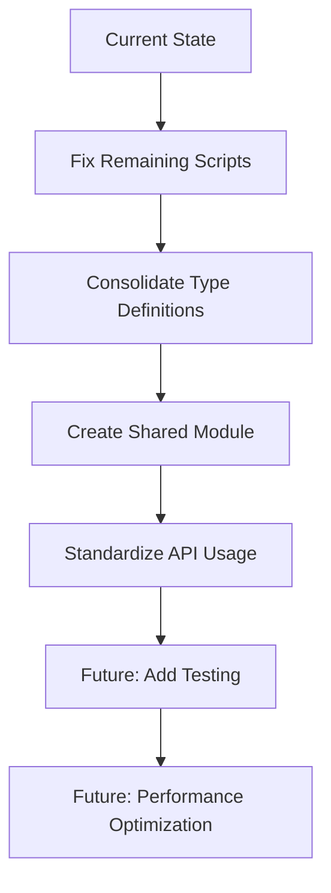

# PowerShell Type Definition Conflict Resolution

## Overview

This document provides comprehensive technical documentation for the PowerShell type definition conflict resolution solution implemented across Windows visual effects automation scripts. The solution addresses the "SystemParams type already exists" error and parameter conversion issues that occur when multiple scripts attempt to define the same types.

## Problem Analysis

### Error Description
The primary issue manifests as PowerShell runtime errors when attempting to load multiple scripts that define identical P/Invoke types:

```powershell
Add-Type : Cannot add type. The type name 'SystemParams' already exists.
```

### Root Cause Analysis
The conflict occurs because:

1. **Duplicate Type Definitions**: Multiple scripts define identical [`SystemParams`](modules/VisualEffects.psm1:27) classes with [`SystemParametersInfo`](windows/optimization/visuals/toggle-animate-windows.ps1:37) P/Invoke declarations
2. **No Existence Checks**: Original implementations used direct [`Add-Type`](windows/optimization/visuals/toggle-smooth-fonts.ps1:16) calls without checking if types already exist
3. **Shared Session State**: PowerShell sessions maintain loaded types across script executions
4. **Parameter Conversion Issues**: Some scripts used [`ref bool`](windows/optimization/visuals/toggle-smooth-fonts.ps1:21) parameters while others required [`IntPtr`](windows/optimization/visuals/toggle-animate-windows.ps1:37) handling

## Solution Implementation

### Pattern Using PSTypeName Checks
The fix pattern implements type existence verification using [`System.Management.Automation.PSTypeName`](modules/VisualEffects.psm1:27):

```powershell
# Check if type already exists to avoid conflicts
if (-not ([System.Management.Automation.PSTypeName]'SystemParams').Type) {
    Add-Type @"
using System;
using System.Runtime.InteropServices;

public class SystemParams {
    [DllImport("user32.dll", SetLastError = true)]
    public static extern bool SystemParametersInfo(uint uiAction, uint uiParam, IntPtr pvParam, uint fWinIni);
}
"@
}
```

### Technical Details

#### IntPtr Parameter Handling
The solution standardizes on [`IntPtr`](windows/optimization/visuals/toggle-animate-windows.ps1:37) parameter handling for maximum compatibility:

```powershell
# Allocate unmanaged memory for the struct
$animInfoPtr = [System.Runtime.InteropServices.Marshal]::AllocHGlobal($animInfo.cbSize)
[System.Runtime.InteropServices.Marshal]::StructureToPtr($animInfo, $animInfoPtr, $false)

# Use IntPtr parameter
$result = [SystemParams]::SystemParametersInfo($SPI_GETANIMATION, 0, $animInfoPtr, 0)
```

#### Marshal Operations
The implementation uses [`Marshal`](windows/optimization/visuals/toggle-animate-windows.ps1:58) operations for proper memory management:

- [`AllocHGlobal`](windows/optimization/visuals/toggle-animate-windows.ps1:58): Allocates unmanaged memory
- [`StructureToPtr`](windows/optimization/visuals/toggle-animate-windows.ps1:59): Copies structure to unmanaged memory
- [`PtrToStructure`](windows/optimization/visuals/toggle-animate-windows.ps1:69): Reads structure from unmanaged memory
- [`FreeHGlobal`](windows/optimization/visuals/toggle-animate-windows.ps1:64): Releases allocated memory

## Code Examples

### Before: Problematic Implementation

```powershell
# Add P/Invoke for SystemParametersInfo
Add-Type @"
using System;
using System.Runtime.InteropServices;
public class SystemParams {
    [DllImport("user32.dll", SetLastError = true)]
    public static extern bool SystemParametersInfo(uint uiAction, uint uiParam, ref bool pvParam, uint fWinIni);
}
"@
```

### After: Fixed Implementation

```powershell
# Add P/Invoke for SystemParametersInfo
# Check if type already exists to avoid conflicts
if (-not ([System.Management.Automation.PSTypeName]'SystemParams').Type) {
    Add-Type @"
using System;
using System.Runtime.InteropServices;
public class SystemParams {
    [DllImport("user32.dll", SetLastError = true)]
    public static extern bool SystemParametersInfo(uint uiAction, uint uiParam, IntPtr pvParam, uint fWinIni);
}
"@
}
```

## Fixed Scripts

The following scripts have been successfully updated with the type conflict resolution pattern:

1. [`toggle-animate-windows.ps1`](windows/optimization/visuals/toggle-animate-windows.ps1:17-40)
2. [`toggle-shadows-under-windows.ps1`](windows/optimization/visuals/toggle-shadows-under-windows.ps1:17-26)
3. [`toggle-shadows-under-mouse.ps1`](windows/optimization/visuals/toggle-shadows-under-mouse.ps1:17-26)

## Remaining Scripts Requiring Fixes

The following scripts still require the type conflict resolution pattern to be applied:

1. [`toggle-smooth-fonts.ps1`](windows/optimization/visuals/toggle-smooth-fonts.ps1:16-23)
2. [`toggle-fade-tooltips.ps1`](windows/optimization/visuals/toggle-fade-tooltips.ps1:16-23)
3. [`toggle-window-contents-dragging.ps1`](windows/optimization/visuals/toggle-window-contents-dragging.ps1:16-23)
4. [`toggle-animate-controls.ps1`](windows/optimization/visuals/toggle-animate-controls.ps1:16-23)
5. [`toggle-fade-menus.ps1`](windows/optimization/visuals/toggle-fade-menus.ps1:16-23)
6. [`toggle-smooth-scroll.ps1`](windows/optimization/visuals/toggle-smooth-scroll.ps1:16-23)
7. [`toggle-combo-box-animation.ps1`](windows/optimization/visuals/toggle-combo-box-animation.ps1:16-23)
8. [`toggle-fade-menu-items.ps1`](windows/optimization/visuals/toggle-fade-menu-items.ps1:16-23)

## Best Practices

### Type Definition Guidelines

1. **Always Check Type Existence**: Use [`PSTypeName`](modules/VisualEffects.psm1:27) checks before defining types
2. **Standardize Parameter Types**: Use [`IntPtr`](windows/optimization/visuals/toggle-animate-windows.ps1:37) for maximum compatibility
3. **Implement Proper Memory Management**: Always pair [`AllocHGlobal`](windows/optimization/visuals/toggle-animate-windows.ps1:58) with [`FreeHGlobal`](windows/optimization/visuals/toggle-animate-windows.ps1:64)
4. **Use Consistent Type Names**: Maintain consistent naming across scripts

### Code Quality Standards

```powershell
# Good: Type existence check with proper error handling
if (-not ([System.Management.Automation.PSTypeName]'SystemParams').Type) {
    try {
        Add-Type @"
        // Type definition
        "@
    }
    catch {
        Write-Error "Failed to add type: $($_.Exception.Message)"
    }
}

# Bad: Direct type definition without checks
Add-Type @"
// Type definition - may cause conflicts
"@
```

## Future Recommendations

### Type Definition Consolidation

1. **Shared Module Approach**: Consolidate all P/Invoke type definitions into [`modules/VisualEffects.psm1`](modules/VisualEffects.psm1)
2. **Centralized Type Registry**: Create a central type registry module for all Windows API types
3. **Standardized Interfaces**: Define common interfaces for Windows API operations

### Implementation Roadmap



### Migration Strategy

1. **Phase 1**: Apply type conflict resolution pattern to remaining 8 scripts
2. **Phase 2**: Extract common type definitions to [`VisualEffects.psm1`](modules/VisualEffects.psm1)
3. **Phase 3**: Update scripts to use shared type definitions
4. **Phase 4**: Implement comprehensive testing and validation

## Technical Reference

### PSTypeName Usage

The [`System.Management.Automation.PSTypeName`](modules/VisualEffects.psm1:27) class provides type existence checking:

```powershell
# Check if a type exists
if (-not ([System.Management.Automation.PSTypeName]'TypeName').Type) {
    # Type doesn't exist - safe to define
    Add-Type @"
    // Type definition
    "@
}
```

### Marshal Operations Reference

| Operation | Purpose | Example |
|-----------|---------|---------|
| [`AllocHGlobal`](windows/optimization/visuals/toggle-animate-windows.ps1:58) | Allocate unmanaged memory | `Marshal::AllocHGlobal(size)` |
| [`StructureToPtr`](windows/optimization/visuals/toggle-animate-windows.ps1:59) | Copy structure to memory | `Marshal::StructureToPtr(obj, ptr, false)` |
| [`PtrToStructure`](windows/optimization/visuals/toggle-animate-windows.ps1:69) | Read structure from memory | `Marshal::PtrToStructure(ptr, [type])` |
| [`FreeHGlobal`](windows/optimization/visuals/toggle-animate-windows.ps1:64) | Release allocated memory | `Marshal::FreeHGlobal(ptr)` |

## Conclusion

The PowerShell type definition conflict resolution solution provides a robust pattern for preventing type conflicts in Windows automation scripts. By implementing existence checks and standardizing parameter handling, the solution ensures script reliability and maintainability across multiple executions.

This documentation serves as both a troubleshooting guide and development reference for maintaining and extending the Windows visual effects automation system.